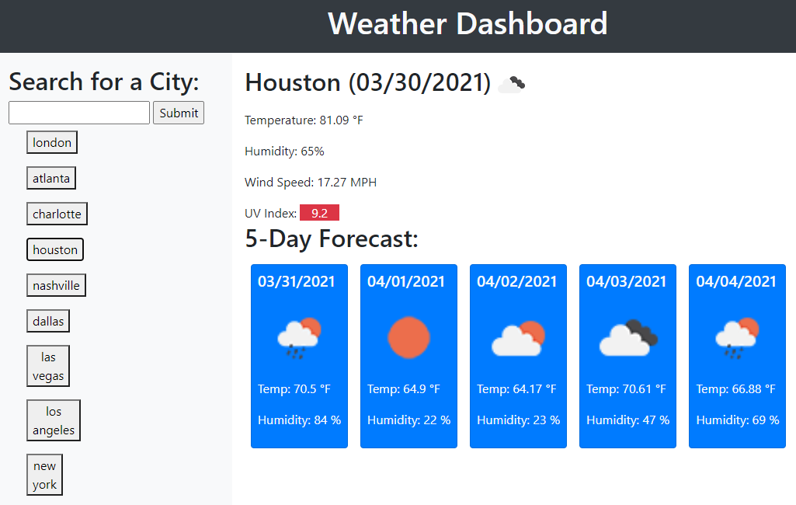

# City Weather Dashboard

This retrieves weather data for a city, returning the current temperature, humidity, wind speed, and UN index as well as a five-day weather forecast. This application utilizes two different endpoints from the OpenWeather API (https://openweathermap.org/api).

[City Weather Dashboard](https://matthale11.github.io/weather-dashboard/)

